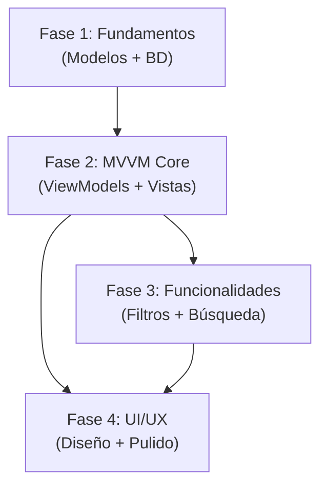

# Plan de Implementación por Fases - Sistema de Gestión de Listas de Tareas

## 📋 Resumen Ejecutivo

Este plan divide la implementación en **4 fases principales** con entregables claros, estimando **4-5 semanas** de desarrollo total.

---

## 🎯 Fase 1: Fundamentos y Arquitectura (Semana 1)

### Objetivos
Establecer la base de datos, modelos y arquitectura core del proyecto.

### Tareas

#### 1.1 Configuración del Proyecto
- [ ] Agregar paquetes NuGet requeridos:
  - `Microsoft.EntityFrameworkCore` (8.0.*)
  - `Microsoft.EntityFrameworkCore.Sqlite` (8.0.*)
  - `Microsoft.EntityFrameworkCore.Design` (8.0.*)
  - `CommunityToolkit.Mvvm` (8.2.*)
- [ ] Configurar estructura de carpetas en `DemoWinForms.Core`
- [ ] Configurar estructura de carpetas en `DemoWpf`

#### 1.2 Modelos de Dominio (DemoWinForms.Core)
- [ ] Crear `TaskList.cs` con propiedades básicas
- [ ] Crear `TaskItem.cs` con propiedades básicas
- [ ] Crear `Enums.cs` (TaskPriority, TaskStatus)
- [ ] Implementar validaciones de atributos

#### 1.3 Capa de Datos
- [ ] Crear `TaskDbContext.cs` con configuración EF Core
- [ ] Configurar relaciones entre TaskList y TaskItem
- [ ] Crear migración inicial
- [ ] Verificar creación de base de datos SQLite

#### 1.4 Repositorio e Interfaces
- [ ] Definir `ITaskRepository.cs`
- [ ] Implementar `TaskRepository.cs` con operaciones CRUD básicas
- [ ] Crear `TaskService.cs` como capa de servicios

### Entregables
✅ Base de datos SQLite funcional  
✅ Modelos de dominio completos  
✅ Repositorio con operaciones CRUD  
✅ Pruebas unitarias básicas (opcional)

---

## 🏗️ Fase 2: Funcionalidad Core MVVM (Semana 2)

### Objetivos
Implementar ViewModels y vistas básicas con funcionalidad CRUD completa.

### Tareas

#### 2.1 ViewModels Base
- [ ] Crear `BaseViewModel.cs` con CommunityToolkit.Mvvm
- [ ] Implementar `MainViewModel.cs`:
  - Propiedad `ObservableCollection<TaskListViewModel>`
  - Comandos: CreateList, DeleteList, SelectList
- [ ] Implementar `TaskListViewModel.cs`:
  - Propiedad `ObservableCollection<TaskItemViewModel>`
  - Propiedades calculadas (TotalTasks, CompletedCount)
- [ ] Implementar `TaskItemViewModel.cs`:
  - Binding bidireccional de propiedades
  - Comando ToggleCompleted

#### 2.2 Vistas XAML Básicas
- [ ] Diseñar `MainWindow.xaml` con layout de dos columnas
- [ ] Crear panel lateral de listas (ListBox/ListView)
- [ ] Crear área principal de tareas (ListView con DataTemplate)
- [ ] Implementar `TaskListDialog.xaml` (crear/editar lista)
- [ ] Implementar `TaskItemDialog.xaml` (crear/editar tarea)

#### 2.3 Conectar ViewModel con Vista
- [ ] Configurar DataContext en `MainWindow`
- [ ] Implementar bindings en XAML
- [ ] Crear comandos ICommand para botones
- [ ] Implementar navegación entre listas

### Entregables
✅ CRUD completo de listas de tareas  
✅ CRUD completo de tareas individuales  
✅ Navegación funcional entre listas  
✅ Persistencia de datos operativa

---

## 🎨 Fase 3: Funcionalidades Avanzadas (Semana 3)

### Objetivos
Agregar filtros, búsqueda, ordenamiento y características avanzadas del PRD.

### Tareas

#### 3.1 Filtros y Ordenamiento
- [ ] Implementar filtros por estado (Pendiente/Completada)
- [ ] Implementar filtro por prioridad
- [ ] Implementar filtro por fecha de vencimiento
- [ ] Agregar ordenamiento (fecha, prioridad, alfabético)
- [ ] Crear ComboBox/ToggleButton para filtros en UI

#### 3.2 Búsqueda
- [ ] Implementar búsqueda en títulos de tareas
- [ ] Implementar búsqueda en descripciones
- [ ] Agregar TextBox de búsqueda con binding reactivo
- [ ] Destacar resultados de búsqueda

#### 3.3 Funcionalidades Avanzadas
- [ ] Implementar "Mover tarea a otra lista"
- [ ] Agregar selector de color para listas
- [ ] Implementar DatePicker para fechas de vencimiento
- [ ] Crear selector de prioridad (RadioButtons/ComboBox)
- [ ] Agregar ConfirmationDialog reutilizable

#### 3.4 Estadísticas
- [ ] Calcular estadísticas en MainViewModel
- [ ] Mostrar totales en dashboard
- [ ] Implementar contador de tareas vencidas
- [ ] Agregar indicadores visuales de progreso

### Entregables
✅ Filtros funcionales por estado, prioridad y fecha  
✅ Búsqueda global de tareas  
✅ Mover tareas entre listas  
✅ Dashboard con estadísticas

---

## 💎 Fase 4: UI/UX y Pulido (Semana 4-5)

### Objetivos
Mejorar la experiencia de usuario, diseño visual y optimización.

### Tareas

#### 4.1 Diseño Visual
- [ ] Decidir biblioteca UI (MaterialDesignThemes/Fluent/Custom)
- [ ] Crear `Styles.xaml` con estilos consistentes
- [ ] Diseñar paleta de colores
- [ ] Implementar tema claro/oscuro
- [ ] Crear iconos personalizados en `Icons.xaml`

#### 4.2 Converters y Ayudas Visuales
- [ ] Crear `PriorityToColorConverter.cs` (Baja=🟢, Alta=🔴)
- [ ] Crear `StatusToIconConverter.cs`
- [ ] Crear `DateToRelativeConverter.cs` ("Hace 2 días")
- [ ] Implementar barras de progreso visuales

#### 4.3 Validaciones y Mensajes
- [ ] Validar nombres de listas duplicados
- [ ] Validar campos obligatorios
- [ ] Mostrar mensajes de error amigables
- [ ] Implementar tooltips informativos
- [ ] Agregar animaciones de feedback

#### 4.4 Características Avanzadas de UI
- [ ] Implementar drag & drop entre listas
- [ ] Agregar atajos de teclado:
  - `Ctrl+N`: Nueva tarea
  - `Ctrl+L`: Nueva lista
  - `Delete`: Eliminar selección
- [ ] Implementar auto-guardado
- [ ] Agregar loading indicators

#### 4.5 Optimización y Testing
- [ ] Implementar virtualización en listas grandes
- [ ] Optimizar consultas a base de datos
- [ ] Pruebas de rendimiento (100 listas, 1000 tareas)
- [ ] Pruebas de usuario (UAT)
- [ ] Corregir bugs identificados

### Entregables
✅ UI moderna y responsive  
✅ Temas claro/oscuro funcionales  
✅ Drag & drop operativo  
✅ Validaciones completas  
✅ Rendimiento optimizado (<2s carga, <100ms operaciones)

---

## 📊 Diagrama de Dependencias

---

## 🚀 Hitos y Checkpoints

| Semana | Hito | Demo |
|--------|------|------|
| **1** | Base de datos + Modelos | Crear lista y tarea desde consola |
| **2** | CRUD funcional en UI | Crear/editar/eliminar listas y tareas |
| **3** | Filtros y búsqueda | Buscar tareas, filtrar por estado |
| **4** | UI completa | Demo con diseño final y drag & drop |
| **5** | Release v1.0 | Aplicación lista para producción |

---

## ⚠️ Riesgos por Fase

### Fase 1
- **Riesgo**: Problemas con migraciones de EF Core  
- **Mitigación**: Usar SQLite en modo archivo para debugging

### Fase 2
- **Riesgo**: Complejidad de bindings MVVM  
- **Mitigación**: Usar CommunityToolkit.Mvvm y tutoriales oficiales

### Fase 3
- **Riesgo**: Rendimiento con filtros complejos  
- **Mitigación**: Implementar filtrado en BD, no en memoria

### Fase 4
- **Riesgo**: Drag & drop puede ser complejo  
- **Mitigación**: Considerar moverlo a v1.1 si bloquea release

---

## 📦 Orden de Implementación Recomendado

1. **Empezar con**: Modelos → DbContext → Repositorio
2. **Continuar con**: MainViewModel → MainWindow básica
3. **Agregar**: CRUD de listas → CRUD de tareas
4. **Expandir**: Filtros → Búsqueda → Estadísticas
5. **Finalizar**: Diseño visual → Validaciones → Optimización

---

## 🎯 Definición de "Hecho" (DoD)

Para considerar cada fase completa:
- ✅ Código compilando sin warnings
- ✅ Funcionalidad probada manualmente
- ✅ Persistencia de datos verificada
- ✅ Sin errores en runtime
- ✅ Código comentado (secciones complejas)

---

¿Quieres que comience con la **Fase 1** implementando los modelos y la base de datos? Puedo generar el código completo para:
- Modelos (`TaskList`, `TaskItem`, `Enums`)
- `TaskDbContext` con configuración EF Core
- Repositorio base con operaciones CRUD